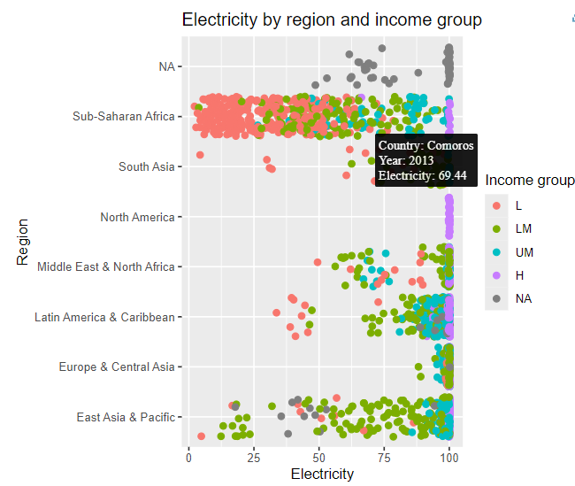

# J  {#sec-j}

```{r, echo=FALSE, warning=FALSE, message=FALSE}
library(tidyverse)
library(drone)
library(patchwork)
library(ggpattern)
data("worldbankdata")
```

## geom_jitter {#jitter}

**Package**

ggplot2 [@ggplot2]

**Description**

Adds a small amount of random variation to the location of each point, horizontally and/or vertically.


**See also**

[geom_point](#point)

**Example**


```{r,  message=FALSE, warning=FALSE}
a1 <- worldbankdata |>
  ggplot(aes(x=Income, y=Electricity)) + 
  geom_jitter() + ggtitle("a1: geom_jitter")
a2 <- worldbankdata |>
  ggplot(aes(x=Income, y=Electricity)) + 
  geom_point() + ggtitle("a1: geom_point")
a1 | a2

```

## geom_jitter_interactive

**Package**

ggiraph [@ggiraph]

**Description**

Adds interactive features like tooltips and hyperlinks, allowing for dynamic exploration of jittered data points in a plot.

**Understandable aesthetics**

*required aesthetics*
  
  `x`

`y`

*optional aesthetics*
  
  `alpha`, `colour`, `group`, `linetype`, `linewidth`


**See also**

[geom_point](#point), [geom_ribbon](#jitter)
  

**Example**

```{r, message=FALSE, warning=FALSE, eval=FALSE}
library(ggiraph)
p <- ggplot(worldbankdata, aes(y = Region, x = Electricity, color = Income)) +
  geom_jitter_interactive(aes(tooltip = paste("Country:", Country, 
                                              "<br>Year:", Year, 
                                              "<br>Electricity:", Electricity)),
                          size = 2, width = 0.3) + 
  labs(title = "Electricity by region and income group",
      y = "Region",
       x = "Electricity",
       color = "Income group") 
x <- girafe(ggobj = p)
if( interactive() ) print(x)

```

